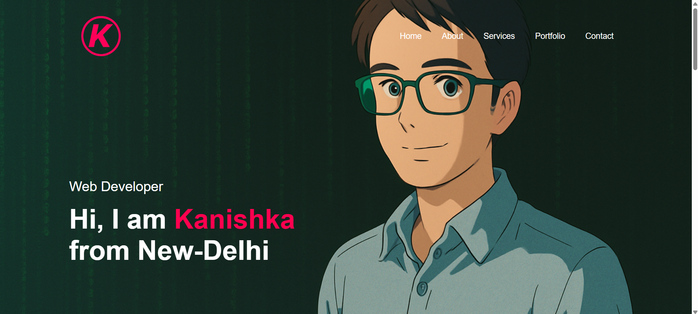
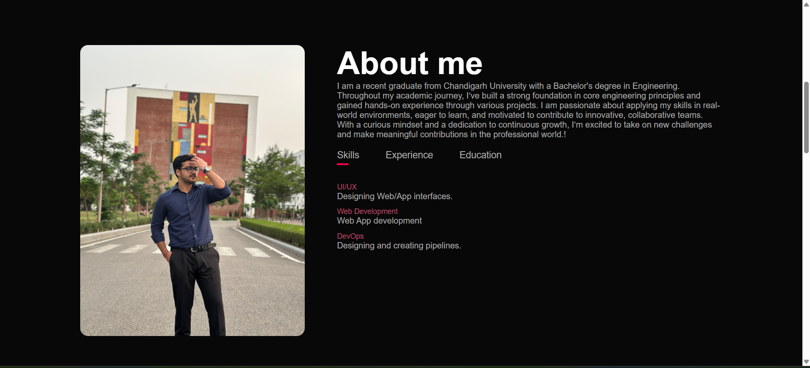
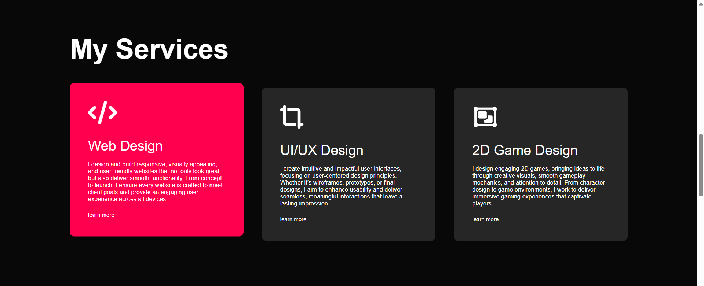
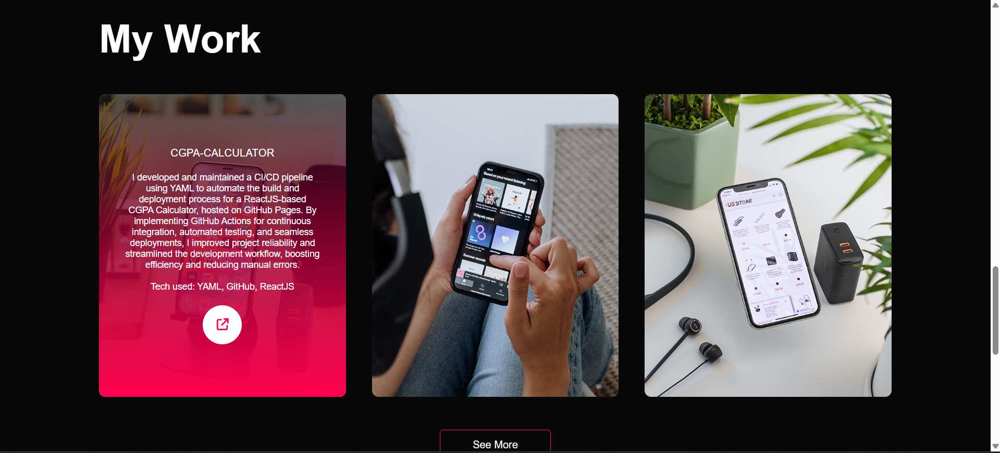
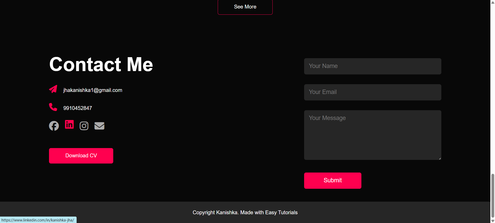

This is my personal **portfolio website**, built to showcase my skills, projects, and services.  
The website is **fully responsive**, ensuring smooth accessibility across desktops, tablets, and mobile devices.  

🔗 Live Demo: https://kanishka-jha-portflio.netlify.app/

---

## ✨ Features  
- 📖 **About Me Section** – Highlights my background, skills, and education  
- 🛠️ **My Services Section** – Web Design, UI/UX Design, and 2D Game Design  
- 📂 **Portfolio Section** – Showcases my projects with descriptions and links  
- 📬 **Contact Section** – Integrated form, email, and social media links  
- 📱 **Responsive Design** – Optimized for both desktop and mobile devices  

---

## 🖥️ Tech Stack  
- **HTML5, CSS3, JavaScript**  
- **Netlify** for deployment

- ## 📸 Screenshots  

### Home Page  
  

### About Me  
  

### Services  
  

### Portfolio  
  

### Contact  

